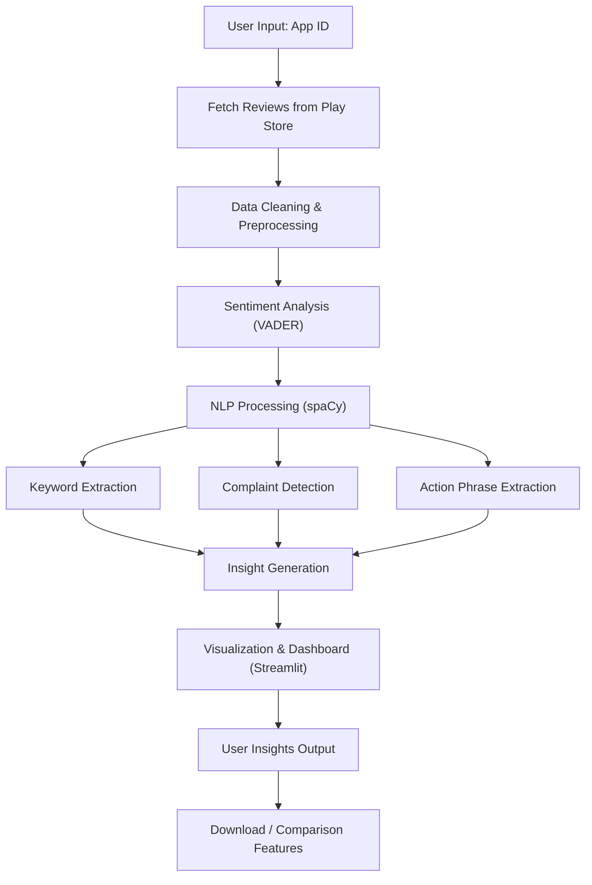

# ReviewLens 🔍 [(Click here for app)](https://reviewlens.streamlit.app/)

## 🚀 Overview
ReviewLens is an AI-powered app review analysis tool that extracts meaningful insights from user reviews on the Google Play Store. It helps identify user sentiments, recurring complaints, strengths, and trends, enabling better product decisions.

---

## 🛠 Tech Stack

- **Frontend:** Streamlit  
- **Backend:** Python  
- **NLP:** spaCy  
- **Sentiment Analysis:** VADER  
- **Data Processing:** Pandas 
- **Visualization:** Matplotlib, Seaborn  
- **Data Source:** google-play-scraper  

---

## 💡 Introduction

ReviewLens analyzes app reviews and transforms raw user feedback into actionable insights. It provides:

- Sentiment analysis (positive/negative/neutral)
- Keyword extraction
- Complaint detection
- Actionable insights generation
- Time-based sentiment trends
- Cross-app comparison

👉 Goal: Help developers and product managers understand user pain points and improve their apps.

---

## 🤔 Why These Technologies?

- **Streamlit:** Rapid UI development for data apps with minimal frontend effort  
- **spaCy:** Efficient NLP pipeline for extracting phrases and linguistic patterns  
- **VADER:** Lightweight and effective sentiment analysis for short texts like reviews  
- **Pandas:** Fast and reliable data manipulation  
- **Matplotlib & Seaborn:** Simple and effective data visualization  
- **google-play-scraper:** Direct access to real user reviews from Play Store  

---

## 🔄 Workflow Diagram



---

## 📦 How to Clone the Repository

```bash
git clone https://github.com/Yasshh82/ReviewLens.git
cd reviewlens
```

---

## ▶️ How to Run Locally

1. **Create Virtual Environment**
   ```bash
   python -m venv venv
   source venv/bin/activate   # On Windows: venv\Scripts\activate
   ```
2. **Install Dependencies**
   ```bash
   pip install -r requirements.txt
   ```
3. **Run the App**
   ```bash
   streamlit run app/main.py
   ```

---

## 🌐 Live App

[https://reviewlens.streamlit.app/](https://reviewlens.streamlit.app/)

---

## 👨‍💻 Author

**Yash Gupta**

📧 [yash8740gupta@gmail.com](yash8740gupta@gmail.com)

🔗 [https://www.linkedin.com/in/yash-gupta82/](https://www.linkedin.com/in/yash-gupta82/)

---
